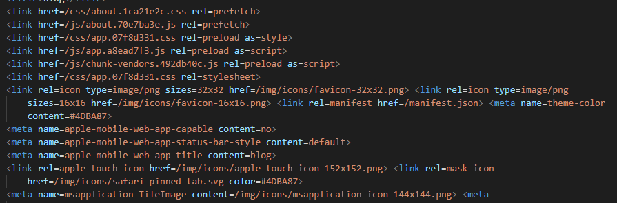

## 0.前言
---
以前学习的时候，偶尔也有整理自己知识体系的时候，然而经过一系列面试后，感觉自己的前端知识体系不完整，许多本应该简单的就能实现的效果自己却弄的很麻烦，或者设计模式上出了一些问题，导致代码块臃肿、难以添加新feature并且难以维护。因此在杨子航的推荐下，决定用Github Pages搭建一个自己的博客，记录自己学习中遇到的问题。希望在将来的学习中，遇到的问题可以总结下来，方便自己查阅。
## 1.使用Github Pages
***
首先创建一个仓库，用来存放自己的博客项目，根据github官方文档的描述
>You can configure GitHub Pages to publish your site's source files from **master**, **gh-pages**, or a **/docs** folder on your **master** branch for Project Pages and other Pages sites that meet certain criteria.
>
它给出了两种配置你网页的方式
1. 在你**master**或者**gh-pages**分支的项目里，读取根目录的index.html文件，将其渲染出来<br>
官方给出的说法是
>To select **master** or **gh-pages** as your publishing source, you must have the branch present in your repository
>
注意：**这种情况下，官方只允许访问\<username\>.github.io这个路径，并且默认访问index.html文件，其他路径均没有配置，只能返回404**<br>
因此我个人第一次尝试，就是修改Vue.config.js,```indexPath='../index.html'```，这样做打包后的目录如下
<br>
部署后发现打开后一片空白，原来是资源文件没有正确被引用，打开index.html看一下
<br>
由于打包后的静态资源全在dist中，因此index.html无法正确引用这些css和script，再次修改Vue.config.js，```publicPath='./dist'```，直接本地打开index.html看下
<br>
那么问题解决了吗，部署上git后发现，完全不行，**publicPath**虽然能将link的引用正确指向dist文件夹，然而它也改变了，因此这里需要改变一下，打开router.ts(如果你们没选ts，就是router.js)，修改路由中的```base: process.env.BASE_URL```为```base:''```，这样做的原因是，publicPath已经被修改为'./dist'，然而GitHubPages支持访问\<username\>.github.io这个路由，无法访问\<username\>.github.io/dist这个路由，这样部署的话，完美解决)<br>
那么这么做是否没有瑕疵呢？有一点！由于选择的模式是history模式，因此当你跳转到其他路由时，页面没有刷新，动态加载组件，没有问题，然而如果在其他路由手动刷新页面，会提示404页面，这正是由于GitHubPages只支持\<username\>.github.io这个路由，因此我们将history模式改为hash模式，就完美解决。在router.ts文件中，将```mode:'history'```去掉即可，这样一来，就部署成功了！
2. 将你**master**分支上**docs**文件夹里的静态文件全部渲染出来
<style>
blockquote{
    padding: 0 1.5rem;
    color: #4e4e4e;
    font-size: 1rem;
    border-left: 0.4rem solid #ddd;
    line-height: 1.5;
    font-family: "Inter","-apple-system,BlinkMacSystemFont","Segoe UI",Helvetica,Arial,sans-serif,"Apple Color Emoji","Segoe UI Emoji","Segoe UI Symbol";
}
p{
    line-height:1.5
}
li{
    line-height:1.5
}
code{
    color: #476582;
    padding: .25rem .5rem;
    margin: 0;
    font-size: .85em;
    background-color: rgba(27,31,35,.05);
    border-radius: 3px;
    font-family: 'source-code-pro','Menlo','Monaco','Consolas','Courier New','monospace';
}