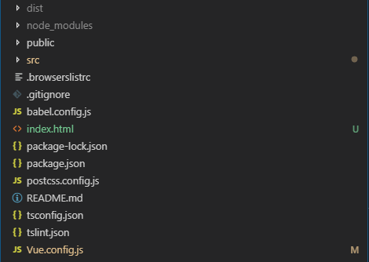
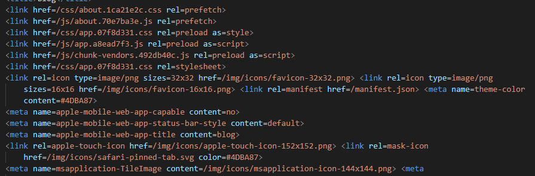
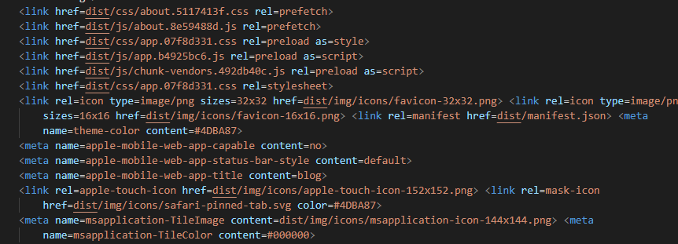

## 前言
以前学习的时候，偶尔也有整理自己知识体系的时候，然而经过一系列面试后，感觉自己的前端知识体系不完整，许多本应该简单的就能实现的效果自己却弄的很麻烦，或者设计模式上出了一些问题，导致代码块臃肿、难以添加新feature并且难以维护。因此在杨子航的推荐下，决定用Github Pages搭建一个自己的博客，记录自己学习中遇到的问题。希望在将来的学习中，遇到的问题可以总结下来，方便自己查阅。
## 使用Github Pages
首先创建一个仓库，用来存放自己的博客项目，根据github官方文档的描述
>**You can configure GitHub Pages to publish your site's source files from ``master``, ``gh-pages``, or a ``/docs`` folder on your ``master`` branch for Project Pages and other Pages sites that meet certain criteria.**

这里出了两种配置网页的方式
#### 1. 在你```master```或者```gh-pages```分支的项目里，读取根目录的```index.html```文件，将其渲染出来<br>
官方给出的说法是
>**To select ``master`` or ``gh-pages`` as your publishing source, you must have the branch present in your repository**

<blockquote class='warn'>
这种情况下，官方只允许访问<code>&lt;username&gt;.github.io</code>这个路径，并且默认访问<code>index.html</code>文件，其他路径均没有配置，只能返回404
</blockquote>

因此我个人第一次尝试，就是修改``Vue.config.js``,添加一行``indexPath='../index.html'``，这样做打包后的目录如下<br>



部署后发现打开后一片空白，原来是资源文件没有正确被引用，打开``index.html``看一下<br>



由于打包后的静态资源全在dist中，因此index.html无法正确引用这些css和script，再次修改``Vue.config.js``，添加一行```publicPath='./dist'```，直接本地打开``index.html``看下



那么问题解决了吗，部署上git后发现，完全不行，``publicPath``虽然能将link的引用正确指向dist文件夹，然而``publicPath``决定着整个项目启动的根路径，它被设置为``'./dist'``后，项目的访问路径变成了``<username>.github.io/dist``。

因此这里需要改变一下，打开``router.ts``(如果你们没选ts，就是``router.js``)，修改路由中的```base: process.env.BASE_URL```为```base:''```，这样做的原因是，publicPath已经被修改为``'./dist'``，然而GitHubPages支持访问``<username>.github.io``这个路由，无法访问``<username>.github.io/dist``这个路由，这样部署的话，完美解决！

那么这么做是否没有瑕疵呢？有一点！由于选择的模式是history模式，因此当你跳转到其他路由时，页面没有刷新，动态加载组件，没有问题，然而如果在其他路由手动刷新页面，会提示404页面，这正是由于GitHubPages只支持``<username>.github.io``这个路由，因此我们将history模式改为hash模式，就完美解决。在``router.ts``文件中，将```mode:'history'```去掉即可，这样一来，就部署成功了！

最后的``Vue.config.js``如下
```js
module.exports = {

    indexPath: "../index.html",

    publicPath: process.env.NODE_ENV == "development" ? "" : "./dist"
    
}
```


<blockquote class='tip'>
 由于在本地开发时，base和publicPath不一致，会导致访问错误，因此建议在<code>Vue.config.js</code>和<code>router.ts</code>中，将publicPath和base均改成<code>process.env.NODE_ENV == "development" ? "" : "./dist"</code>，这样在本地和服务器上均能正常运行
 </blockquote>

 <blockquote class='tip'>
 要在<code>.gitignore</code>里面将dist去掉，不然打包完了也上传不了
 </blockquote>

#### 2. 将你``master``分支上``docs``文件夹里的``index.html``渲染出来<br>

这种情况，官方给出的说法是

>**To publish your site's source files from a ``/docs`` folder on your ``master branch``, you must have a master branch and your repository must:**<br>
>**1. have a ``/docs`` folder in the root of the repository**<br>
>**2. ``not follow`` the repository naming scheme ``<username>.github.io`` or ``<orgname>.github.io``**

因此这里需要做的是，将你的仓库名更改一下，不要按照``<username>.github.io``这种模式即可，我选择改成``blog``，然后按照文档，打开设置，在GithubPages中，选择``master branch/docs folder``选项，然后我们的打包方式就需要做一个小小的改变，``Vue.config.js``如下
```js
module.exports = {

    publicPath: "/blog/",

    outputDir: './docs',

    assetsDir: "./",

}
```

<blockquote class='tip'>
 <code>publicPath</code>要与你仓库名一致，因为GithubPages现在给你的路由是<code>&lt;username&gt;.github.io/repository</code>
 </blockquote>

 <blockquote class='tip'>
 <code>outputDir</code>必须是<code>docs</code>，这与官方要求的渲染docs文件中的文件要求一致
 </blockquote>

 <blockquote class='tip'>
 <code>assetsDir</code>选择用<code>"./"</code>，这样能使路径静态资源相对于<code>outputDir</code>
 </blockquote>

然后编译打包，直接上传部署即可，现在博客url变成了``<username>.github.io/blog``

## 总结
在部署这个Vue应用的时候，遇到了很多问题，例如``Vue.config.js``中各项配置的意义，[如何在vue中嵌入md文件](https://segmentfault.com/q/1010000012829376)等。

部署完这个博客，写了这篇总结，发现自己有很多需要学习的地方，这篇博客不是完结，是学习的开始!

>Be curious about everything. Never stop learning. Never stop growing.